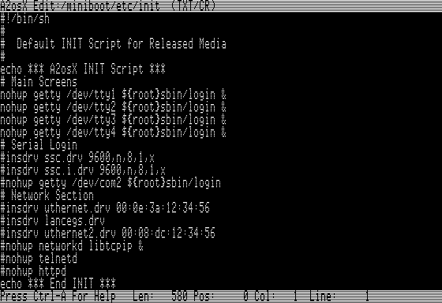

# A2osX Command Guide

This Guide provides information on all the A2osX commands and utilities.  This Guide helps you not only learn the purpose of each command but also what options a command supports and what arguments it either supports or requires.

A2osX comes with a nice variety of system, file, network and data utilities or what we refer to as external commands.  This just means that each of the following commands or utilities is built as a separate BIN or executable file that runs under A2osX.  The source for all of these external commands is readily available, so you can make your own or modify these as your needs dictate.

>Note, that there are some **internal** commands that are build into the shell (the interactive prompt) such as CD (change directory) or PWD (print working directory).  Those commands are discussed in-depth in the **[Shell Developers Guide](.Docs/Shell%20Developers%20Guide.md).**  

## System Commands

Typcically, you will not directly use the System group commands; they are more commonly found in A2osX system scripts such as ./ETC/INIT or they are launched by the A2osX Kernel itself.  All of these commands are found in **./SBIN/** letting you know they are special system commands.

### GETTY

| Command | Options |
| --- | --- |
| GETTY | -E : Exit upon disconnect |

GETTY, short for "get tty", is a system process for A2osX that manages physical or virtual terminals (TTYs). When it detects a connection, it prompts for a username and then loads the system process LOGIN to authenticate the user.  Each GETTY process creates a pseudo file such as /DEV/TTY1 or /DEV/TTY2 to allow A2osX pass input/output streams between processes and connected users.

**GETTY handles 3 types of connections:
- *virtual terminals* presented and controlled by your Apple Screen and Keyboard.  One GETTY process serves one virtual terminal.  You can configure the number of virtual terminals on your A2osX system using the KCONFIG utility.  Please see **[KCONFIG](#kconfig)**. 
- *serial terminals* (or emulated terminals i.e. a PC running a VT-100 emulator) connected to your Apple via a Super Serial Card.  One GETTY process serves one terminal.  See the User Guide for setup and configuration information on connecting Physical Terminals. 
- *internet terminals* connected to your Apple via via the internet using A2osX TCP networking suite.  This suite includes a TELNETD server process that listens for requests from the internet and when such a request is initiated, TELNETD will launch a GETTY process to support that user.  One GETTY process will launch for each TELNET user and will exit when then user disconnects (the TELNETD process calls GETTY with the -E option). 

### INITD

| Command |
| ---- |
| INITD RunLevel |

This is a stub, or a placeholder, for a new routine being added to A2osX.  It will replace part of the startup process and allow for different run levels to be initiated included RunLevel 0 or shutdown.  Full implementation is targeted for 0.94.

### INSDRV

| Command |
| ---- |
| INSDRV Driver |

INSDRV, short for "install driver", is a system process that loads and initializes hardware drivers for A2osX.  Drivers are available for the Apple Mouse, Super Serial Card, and a range of Ethernet cards.  Please see the Hardware section of the User Guide for more complete information on the drivers available for A2osX and enabling them in your system.

### KCONFIG

| Command |
| ---- |
| KCONFIG |

KCONFIG, short for "Kernel Configuration" Utility, is a system program that allows the A2osX administrator to configure various settings of their A2osX system.  Any changes to your system configuration are stored in ${ROOT}/A2OSX.KCONFIG.  When A2osX boots and loads the KERNEL process, it looks for this file, and if not present it initializes the KERNEL with A2osX defaults.

In KCONFIG you can set:
- Machine Timing, either 60 (Default) or 50Hz.  If you change this RGXX will happen.
- CHRoot to /RAMx, either Disabled (Default) or Enabled.  Enabling does RGXX.
- Preemptive Mode, either Disabled (Default) or Enabled.  Enabling does RGXX.
- TTYs, between 1 and 4, default is 2.  This is the number of Virtual Terminals configured on your system.  Please note, increasing and decreasing the number of virtual terminals can have a significant impact on the amount of memory used by the system, which in turns impacts the amount of free memory available to run your A2osX programs and scripts.
- Slots 1-7, Enabled (Default) or Disabled.  If you disable a slot this RGXX will happen.

### LOGIN

| Command |
| ---- |
| LOGIN |

LOGIN is a system process for A2osX that authenticates users against the A2osX User Database stored in ./ETC/PASSWD.  Once a user is authenicated, LOGIN then loads the SH (./BIN/SH) process passing it the PROFILE script found in the users ${HOME} directory.

>Note at this time that the User Database system is not complete so login temporarily defaults to logging in as user ROOT.  

## BIN,External Shell commands:

### CAT

| Command | Options |
| --- | --- |
| CAT | -A : Show All non printable caracters   -N : Number all output lines   -S : Suppress repeated empty output lines |

The CAT command is used to display the contents of files stored on any ProDOS volume.  While the primary use of this tool is to display the contents of TEXT or TXT files, it can be used to display the contents of other files by using the -A option, which will substitute non-printable characters with readable and displayable values such as [EOF] for End of File (Hex x04) or [LF] for Line Feed (Hex x0A).  In addition you can use the -N option to display the listing of a file with line numbers.

As an example, if you had a text file called CATTEXT with the following lines:

    Start of Cattext
	
	
	End of Cattext

Then if you executed at the A2osX prompt:

    /A2OSX/ROOT/$ CAT -N CATTEXT

You would get:

----------
>      1: Start of Cattext
> 	   2:
> 	   3:
> 	   4: End of Cattext
----------

If you did CAT -N -S CATTEXT to suppress the extra blank lines you would see:

----------
>      1: Start of Cattext
> 	   2:
> 	   4: End of Cattext
----------

Note that the numbering of the lines didn't change, because that is their true number in f the file, but CAT removed the redundant blank lines.  Whether there are 2 or 200 blank lines in a row, they will be reduced to just 1.

### CUT

| Command | Options |
| --- | --- |
| CUT | CUT \<opt\> "line"   or   CMD\|CUT \<opt\>   -H : This help screen   -F nn : Output field nn   -M nn : Output starting at nn   -N nn : Output Ending at nn   -S ch : Change default SPACE separator to 'ch' |

The CUT command is used to extract a sub part or portion of a string.  While one use of this command can be used to simply extract substrings much like Basic's MID, LEFT, or RIGHT might be used, it can also be used within the powerful FOR NEXT construct to process fields of columns from files or the output of processes.

As an example, normally when you execute the **LS -L /** command you get output similar to:

    /A2OSX.BUILD/ROOT/$ LS -L /                               
    /RAM3            S3D2 Blocks Used:8 Total:16000                               
    /A2OSX.BUILD     S7D1 Blocks Used: 3230 Total:65535                               
    /MAKE            S7D2 Blocks Used:48946 Total:65535                               

Now, if instead we execute the follow command at the shell prompt:

    /A2OSX.BUILD/ROOT/$ FOR F IN `LS -L /`;ECHO $F;NEXT                                
    /RAM3            S3D2 Blocks Used:8 Total:16000                                
    /A2OSX.BUILD     S7D1 Blocks Used: 3230 Total:65535                                
    /MAKE            S7D2 Blocks Used:48946 Total:65535                                

It looks like the same results, but from now instead of LS simply outputting all of its results at once, each line is being passed to the FOR loop (as VAR $F) where we simply ECHO it.  Now imagine if instead we passed $F to CUT, we can display only specific columns of information as seen in these two examples:

    /A2OSX.BUILD/ROOT/$ FOR F IN `LS -L /`;CUT -M 00 -N 15 $F;NEXT                  
    /RAM3                                                                           
    /A2OSX.BUILD                                                                    
    /MAKE                                                                           

    /A2OSX.BUILD/ROOT/$ FOR F IN `LS -L /`;CUT -M 17 -N 21 $F;NEXT                  
    S3D2                                                                            
    S7D1                                                                            
    S7D2                                                                            

Another use of CUT.  Given a Text File like ./ETC/PASSWORD with the following contents:

    root:1cedeaefaffab15fd23d7a282c6610b1:0:0:A2osX Root:/root:/bin/sh                                
    guest:084e0343a0486ff05530df6c705c8bb4:1000:1000:Guest Account:/home/guest:/bin/sh

Note here the results of various CUT commands that use the -S option to denote : (colon) as the field separator.  This makes CUT a great tool for processing delimited text files.

    /A2OSX.BUILD/ROOT/$ FOR F IN `CAT ../ETC/PASSWD`;CUT -S : -F 1 ${F};NEXT
    root                               
    guest                               

    /A2OSX.BUILD/ROOT/$ FOR F IN `CAT ../ETC/PASSWD`;CUT -S : -F 2 ${F};NEXT
    1cedeaefaffab15fd23d7a282c6610b1                               
    084e0343a0486ff05530df6c705c8bb4                               

    /A2OSX.BUILD/ROOT/$ FOR F IN `CAT ../ETC/PASSWD`;CUT -S : -F 3 ${F};NEXT
    0                               
    1000                               

    /A2OSX.BUILD/ROOT/$ FOR F IN `CAT ../ETC/PASSWD`;CUT -S : -F 5 ${F};NEXT
    A2osX Root                               
    Guest Account                               

### CHGRP

| Command | Options |
| --- | --- |
| CHGRP | In Progress | -C : Continue On Error   -R : Recurse subdirectories | - |

This command is not currently implemented.

### CHMOD

| Command | Options |
| --- | --- |
| CHMOD | In Progress | -C : Continue On Error   -R : Recurse subdirectories | - |

This command is not currently implemented.

### CHOWN

| Command | Options |
| --- | --- |
| CHOWN | In Progress | -C : Continue On Error   -R : Recurse subdirectories | - |

This command is not currently implemented.

### CHTYP

| Command | Options |
| --- | --- |
| CHTYP | Working | -C : Continue On Error   -R : Recurse subdirectories | 0.92 |

### CP

| Command | Options |
| --- | --- |
| CP | -C : Continue On Error   -Q : Quiet   -R : Recurse subdirectories   -Y : Dont't Prompt For Override | 0.93 |

CP, which stands for Copy, is one of the most powerful commands in A2osX.  Not only can it copy files from one ProDOS volume to another, it can copy entire directories or even directory trees from volume to volume, or to another location on the same volume.  This recursive nature allows you to use a single command to copy the contents of an entire ProDOS volume with a single command.  CP also supports wild cards so that you can copy just those files matching a pattern.

### EDIT

| Command | Options |
| --- | --- |
| EDIT | Working | still missing : find/replace | 0.93 |

There is a help screen

### FORMAT

| Command | Options |
| --- | --- |
| FORMAT | In Progress | FORMAT \<BLOCKDEV\> [VOLUME.NAME]   -L : Low-Level Format *not currently supported   -1..9 : Catalog Size (block count) | 0.92 |

The FORMAT command will erase an existing volume and update its name to the VOLUME.NAME supplied.  FORMAT does not currently support low level formatting.  The Volume/Device to be formatted must already be formatted.

### GREP

| Command | Options |
| --- | --- |
| GREP | Working | GREP \<opt\> PATTERN FILE or CMD\|GREP \<opt\> PATTERN   -H : This help screen   -I : Ignore Case   -N : Print line Number | 0.93 |

The GREP command parses multiple lines of input (either from a file or from the redirected output of another command) and only outputs those lines that contain the PATTERN.  In this way, you can thing of the GREP command as a filter.  You can use the -I option to force GREP to ignore case in the PATTERN and the INPUT lines (i.e. it capitalizes both the source and the PATTERN before doing the compare) though it still outputs the actual lines of content that match (their original capitalization is preserved.

Here are 4 examples of GREP:

----------
> /A2OSX.BUILD/ROOT/$ LS -L / | GREP S7                                           
> /A2OSX.BUILD     S7D1 Blocks Used: 3230 Total:65535                             
> /MAKE            S7D2 Blocks Used:48946 Total:65535                             
>
> /A2OSX.BUILD/ROOT/$ GREP :1000: ../ETC/PASSWD
> guest:084e0343a0486ff05530df6c705c8bb4:1000:1000:Guest Account:/home/guest:/bin/sh
>
> /A2OSX.BUILD/ROOT/$ GREP ROOT ../ETC/PASSWD                                     
>
> /A2OSX.BUILD/ROOT/$ GREP -I ROOT ../ETC/PASSWD                                  
> root:1cedeaefaffab15fd23d7a282c6610b1:0:0:A2osX Root:/root:/bin/sh              
----------

In the first example, only those volumes that are attached to Slot 7 are listed.  In the second, you can see that the user account for user 1000 is displayed from the PASSWD file.  In the third, you can see nothing is listed, but once we add the case insensitive option (-I) the root account is listed.

### KILL

| Command | Options |
| --- | --- |
| KILL | KILL \<signal\> PID   -0 : No Signal   -1 : SIGQUIT | 0.93 |

The KILL command kills or terminates a running process.  This can be most useful when you have a running process that is stuck (perhaps you are debugging a program or script); you can switch to another virtual terminal (by pressing Open Apple-1) and executing the PS command to list currently running processes and then executing the KILL command on the errand process (i.e. KILL 27 to terminate process 27).

### LS

| Command | Options |
| --- | --- |
| LS | -A : Print . & ..   -C : Single column listing   -F : Single column, includes full path   -L : long listing with size/date...   -R : Recurse subdirectories |

### LSDEV

| Command | Options |
| --- | --- |
| LSDEV | Working | Dump device Drivers

### LSOF

| Command | Options |
| --- | --- |
| LSOF | Working | List Open Files

### MD5

| Command | Options |
| --- | --- |
| MD5 | Working | MD5 \[ -D : String \| file \]

### MEM

| Command | Options |
| --- | --- |
| MEM | Working | Old dump behavior is now MEMDUMP.  New MEM command displays MEMSTAT (Main, Aux & Kernel Memory)

### MKDIR

| Command | Options |
| --- | --- |
| MKDIR | Working | Make Directory

### MORE

| Command | Options |
| --- | --- |
| MORE | Working | MORE \<File\> or CMD\|MORE \<opt\>   -H : This help screen   -N : Number all output lines   -P : Page mode, no scroll   -S : Process ESC codes

### NSCUTIL

| Command | Options |
| --- | --- |
| NSCUTIL | Working | NSCUTIL DD/MM/YY,hh:mm:ss   Tool for setting time in NSC/DL1216E 

### MV

| Command | Options |
| --- | --- |
| MV | Working | -C : Continue On Error   -Q : Quiet   -R : Recurse subdirectories   -Y : Dont't Prompt For Override

### PS

| Command | Options |
| --- | --- |
| PS | Working | List Processes

### RM

| Command | Options |
| --- | --- |
| RM | Working | RM \[File/Dir, *,? wildcards allowed\]   -C : Continue On Error   -Q : Quiet   -R : Recurse subdirectories 

### SH

| Command |
| ---- |
| SH Script |

## Network Tools

###ARP

| Command |
| ----- |
| ARP |

Dump ARP cache, setup a static ARP entry
 
### DNSINFO

| Command |
| ----- |
| DNSINFO -a option to add host???? |

dump DNS cache, setup a static DNS entry

### HTTPGET 

| Command | Options |
| --- | --- |
|HTTPGET <ip\|host> [port]| -U Url   -F UrlFile|

### IPCONFIG 

| Command | Options |
| --- | --- |
|IPCONFIG |-D : Try to get IP address from DHCP   -E : Read ETC files   -S : Set/Reset TCPIP configuration (-E, then -D if required) |

### NETSTAT 

| Command |
| ----- |
| NETSTAT |

Display socket status

### PING 

| Command |
| ----- |
| PING <ip\|host>   -1..9 : Ping Count |

### TELNET

| Command |
| ----- |
| TELNET <ip\|host> [port] |

### DHCPCLNT

| Command |
| ----- |
| DHCPCLNT |

I am not sure if this command is even used any more.  RGXX??

### HTTPD

| Command |
| ----- |
| HTTPD |

HTTPD is a server process thats listens for incomming requests to server web pages from your A2osX system.  It listens for these requests on port 80.  This server process is in development and is in fact being used for test purposes only right now.  Further document and options will be made available in a future A2osX release.

### TCPIPD

| Command |
| ----- |
| TCPIPD |

This is the main network command.  RGXX needs to explain it to us all.

ARP,IP,ICMP,UDP & TCP ok

### TELNETD

| Command |
| ----- |
| TELNETD -d [port] |

TELNETD is a server process that listens for incoming requests to connect to your A2osX system.  By default it listens on Port 23.  You can change the Telnet Server port by starting the TELNETD process with the --d option and specifying an alternate port.  Typically this would be used to get around local firewall or port restrictions.  One example, is if you are running yoru server at home on a DSL or Cable connection your provider might block port 23.  In addition, if you are running in an environment with only one public IP address and you have another system at that site already running a Telnet server, you can use this option to move your Apple to alternate port.

When TELNETD detects an incoming request it starts a GETTY process and creates a virtual internet terminal for the user and begins the LOGIN process same as the system would for a hardwired terminal.  Note TELNETD requires that you have a supported ethernet card and have configured your system for a network appropriately.

## Developer Tools

While almost every command and program that comes with A2osX can be considered a developer tool, there are a few that are very specifically created to be used for developer.  This section discusses those tools.

### ASM

| Command |
| ----- |
| ASM |

ASM is A2osX's table driven multi-pass macro assembler.  This assembler is still in development and will be released shortly.  Technical documentation for the assembler and its language can be found in **[ASM](./ASM.md)**.  A Guide to using ASM will be forthcoming.

### MEMDUMP

| Command |
| ----- |
| MEMDUMP |

MEMDUMP is a program that allows the developer to display the contents of all of the memory that A2osX is currently using to aide with the debugging of your programs.

RGXX you need to support more info on MEMDUMP and what the columns mean and how to look for mem that your particular program is using.

### RPCDUMP

| Command |
| ----- |
| RPCDUMP |

Tool based on UDP socket API, renamed from RPCINFO   RPCDUMP <ip\|host>

RGXX we need more info on this command.

## Copyright

Copyright 2015 - 2019, Remy Gibert and the A2osX contributors.
