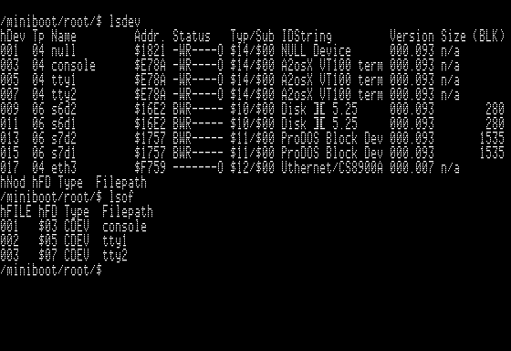

# A2osX Multi-Tasking OS for Apple II  

### Updated February 10, 2020

## Screen Shots

A2osX Booting!

A2osX sports a UNIX-Like Shell as can be seen in the following screen shots.

Here you can see the *ls* command in action, listing the contents on multiple ProDOS volumes.

Here you can see the *mem* command in action, listing the contents on multiple ProDOS volumes. Note in this release, over 27K is available for user programs!

Many development tools are included with A2osX, included a utility to see how memory has been allocated and to which running process.

Admin tools are included as well, such as those needed to see running processes (remember this is a multi-tasking system).

or how about seeing what devices are available/defined or which files are currently open.

A2osX includes a complete TCP/IP Stack.  Here you can see that a network device driver has been loaded and an IP address obtained.

>Note many libraries such as the one for networking, output admin messages as they are initialized or run.  A2osX's console captures these messages as can be seen here.  You can switch to the console at any time by using Open Apple-0.

And here you can see that standard IP utilities are included in A2osX.

This includes a Telnet client!

A2osX includes a robust full screen editor...

...with a convienent Help Screen...

...and advanced dialog boxes.

A2osX includes an advanced Kernel Configuration Utility where you can set many system options.

Lastly, A2osX fully supports Color ANSI/VT-100 Terminals.  While an Apple may not show these colors on its screen, if you connect to A2osX from terminal emulator such as PuTTY, you can see the full color support.

## License
A2osX is licensed under the GNU General Public License.

    This program is free software; you can redistribute it and/or modify
    it under the terms of the GNU General Public License as published by
    the Free Software Foundation; either version 2 of the License, or
    (at your option) any later version.

    This program is distributed in the hope that it will be useful,
    but WITHOUT ANY WARRANTY; without even the implied warranty of
    MERCHANTABILITY or FITNESS FOR A PARTICULAR PURPOSE.  See the
    GNU General Public License for more details.

The full A2osX license can be found **[Here](../LICENSE)**.

## Copyright

Copyright 2015 - 2019, Remy Gibert and the A2osX contributors.
