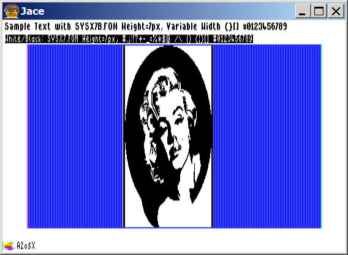

# A2osX (0.92) Multi-Tasking OS for Apple II  

## Screenshots

UNIX-Like Shell...

TCP/IP Stack...

Full screen editor ...

Kernel Configuration Utility...

Color ANSI/VT100 Support...

DHGR Mixed-Mode Graphic primitives....

