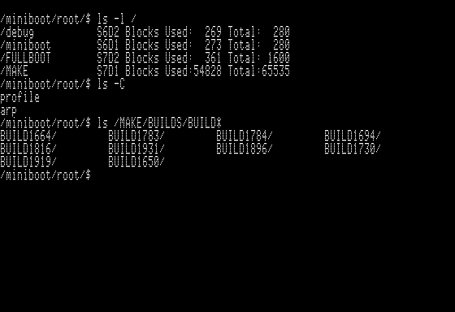
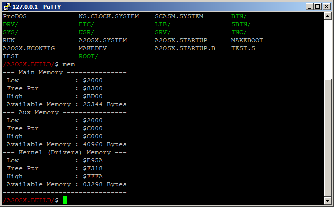

# A2osX (0.93) Multi-Tasking OS for Apple II  

### Updated February 10, 2020

## Screenshots

UNIX-Like Shell...

TCP/IP Stack...

Full screen editor ...

Kernel Configuration Utility...

Color ANSI/VT100 Support...

DHGR Mixed-Mode Graphic primitives....

## License
A2osX is licensed under the GNU General Pulic License.

    This program is free software; you can redistribute it and/or modify
    it under the terms of the GNU General Public License as published by
    the Free Software Foundation; either version 2 of the License, or
    (at your option) any later version.

    This program is distributed in the hope that it will be useful,
    but WITHOUT ANY WARRANTY; without even the implied warranty of
    MERCHANTABILITY or FITNESS FOR A PARTICULAR PURPOSE.  See the
    GNU General Public License for more details.

The full A2osX license can be found **[Here](../LICENSE)**.

## Copyright

Copyright 2015 - 2019, Remy Gibert and the A2osX contributors.
