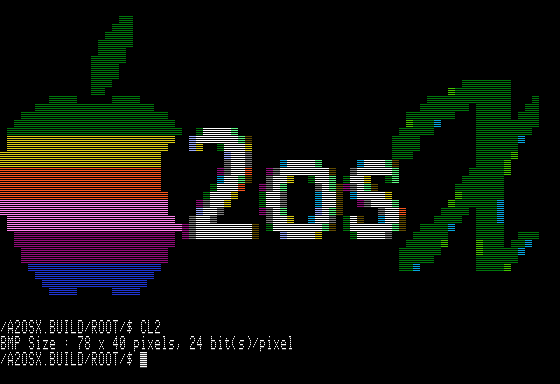

# A2osX (0.93) Multi-Tasking OS for Apple II  

### Updated November 24, 2019

## A2osX Release Candidate now available

See the **[news](#news)** section below for more information.

If you would like to see more screen shots of A2osX click **[here](.Docs/Screen%20Shots.md)**.

## Introduction...

A2osX is an operating, programming and execution environment for the 128K Enhanced Apple //e and Apple //gs series of computers.  While layered atop of ProDOS, taking advantage of all ProDOS block devices and MLI calls; A2osX is much more than an application or command shell. Written in 65C02 assembly for speed of execution and efficient memory management; A2osX is a multitasking and yes multi-user development environment bringing many of today's server operating system features to our venerable vintage 8-bit systems. 

The foundation of A2osX enabling its multi-user multitasking capabilities is a reusable set of APIs and LIBs (written in Assembly) that all programs can and do use which make them very lean and fast.  For instance, there is one network API that any program can call which in turn handles the I/O to different brands of LAN cards via a set of drivers.  In addition, multiple programs can be using the network at the same time such as the TELNETD server and the TELNET client.  A key benefit is that code for each program is smaller because the network API is doing a great deal of the work.  With CORE APIs like printf and LIBs such as Network loaded only once (much like a DLL in Windows) memory is conserved, providing more resources to support your A2osX programs.

## Requires...

A2osX is designed to work on any 128k Enhanced Apple //e or newer computer.  Specifically, A2osX relies on the enhanced instruction set found in the 65C02 processor (this includes the 65C816 found in the //GS).  A2osX will not run on an Apple ][ or ][+, a non enhanced //e or on systems without at least 128K of memory.  A2osX does not require any special hardware cards, but does support and its operation can be enhanced with the presence of a mass storage devices (any ProDOS block device), a network card, Super Serial Card and/or a Time Card.

Consult the **[documentation](#documentation)** section below to find other resources available to you for learning how to install, use, develop and test A2osX.  The Hardware section of the User Guide contains more information on supported hardware.

## News...

**2019-10-31** - Media have been updated based on Build 1694.  This version fixes issues with Piping of commands, adds new READ functionality.  Please note, KM.NSC is no longer loaded by default on any media.  If you have a No Slot Clock in your system, you should move the file KM.NSC from ./SYS/KM into ./SYS which will make it load on boot.

**2019-10-26** - Starting with Build 1675, the SH(ell) command **TIME** has been removed and the **DATE** command will now return both the Date and Time.  Additionally, if DATE command has been updated to support options for returning formatted strings with just the portions of the date and time you desire.  Consult the Shell Developers Guide for syntax.

**2019-10-24** - Created STABLE images with Build 1669 with improvements to TCP networking.  There is also a new DEBUG 140k disk image.  See the media guide for more info.

**2019-10-22** - Updated RC images to Build 1664 which fixed RESTART SYSTEM bug on //GS.

**2019-10-19** - Updated RC images to Build 1653 which fixed bugs in CUT and includes a patched version of ProDOS 2.03 to correct year display for ThunderClocks.

**2019-10-18** - Updated A2osX Release Candidate based on Build No 1650 is now available and can be found in our **[Media directory](.Floppies)**.  In addition, a new disk image **TDBOOT** has been created that is preconfigured to automatically load Uthernet2 driver, start network services and launch the TelnetD server process (hence name TD for TelnetD Boot).

**2019-10-15** - The first A2osX Release Candidate is now available and can be found in our **[Media directory](.Floppies)**.  

2019-04-19 - Major updates have occurred to the kernel and many of the A2osX API's to support a greatly enhanced shell that boasts significant new scripting capabilities since 0.92.  Also added is the the ability to redirect input and output, including errors, and the ability to pipe (|) the output of one command or operation to another (i.e. **ls \* | more** ).  A2osX now provides for multiple virtual terminals as well as users/terminals via TCP (through TELNETD) and serial devices (through a SSC driver).

As great as the changes to A2osX itself, we are also please to report that great strides have been made in terms of documentation.  While much of it is in draft form, there is a new **[Users Guide](.Docs/User%20Guide.md)**, **[Developers Guide](.Docs/Developers%20Guide.md)**, **[Shell Developers Guide](.Docs/Shell%20Developers%20Guide.md)**, **[Technical Spec](.Docs/Technical%20Spec.md)** and **[Command Guide](.Docs/Command%20Guide.md)**.  See the **[Documentation](#documentation)** Section below for more details.

If you would like to read all the past news articles for A2osX, you can read the news article found **[here](.Docs/News.md)**.

## **Visit us at [A2osX](http://www.a2osx.com)**

This is just a place holder and plug for our [A2osX](http://www.a2osx.com) internet site.  Stay tuned here for news about this site.  We have created a Page to discuss A2osX on **[Facebook](https://www.facebook.com/A2osx-372512896625840/)** and have a new **[Twitter](https://twitter.com/A2Osx)** handle to test new A2osX features which will soon be used as a messaging channel, so please follow.

## Disk images...

You can use and/or install A2osX from the media in our Media directory found **[here](.Floppies)**.  Provided media includes **Release**, **RC** (Release Candidate), **Stable** and **Bleed** (Cutting Edge) editions in 140K, 800K and 32MB images.  Please consult our **[Media Guide](.Docs/Media%20Guide.md)** for more information.

## Documentation...

A lot of work has been done to expand and enhance the documentation for A2osX.  Some of this documentation is still in the rough draft stage, provided to you to bring you as much information about A2osX as quickly as possible.  We happily welcome any help and contributions from others to this or any area of the A2osX project.

The repository all A2osX documentation can be found **[here](.Docs)**.  This directory includes the system generated specifications for all the A2osX APIs as well as all our other documentation. 

Of special note please check out our brand new **[Users Guide](.Docs/User%20Guide.md)** and **[Developers Guide](.Docs/Developers%20Guide.md)**. 

### Technical Documentation...

There are two types of Technical Documentation available.  First there is the Automatically Generated Documentation that is created from the source code of A2osX.  These documents capture all the internal A2osX APIs and system calls available to the A2osX programmer.  Developers should scan through these documents before beginning any A2osX project.  In addition, please make sure you look at the programming template file that is the best start to any A2osX program; it can be found **[here](.Docs/.TEMPLATE.S.txt)**.

In addition, there is the developer generated Technical Specifications that document the internal and external A2osX commands, utilities and shell language.  The master technical spec file can be found **[here](.Docs/Technical%20Spec.md)**.

## How You Can Help

The A2osX Team welcomes your help in making this the best operating enviroment for the Apple 2!  Specifically, the more users who can test the most current RELEASE, CANDIDATE or STABLE media on their unique and report back their findings, the better A2osX becomes.  In additions, comments on, suggestions, or contributions to our documentation are greatly appreciated.  Lastly, A2osX would not be what it is without our great core development team. We could certainly use more developers, especially in Assembly (S-C Assembler familiar even better) to contribute new utilities, applications and features for A2osX.

## License
A2osX is licensed under the GNU General Pulic License.

    This program is free software; you can redistribute it and/or modify
    it under the terms of the GNU General Public License as published by
    the Free Software Foundation; either version 2 of the License, or
    (at your option) any later version.

    This program is distributed in the hope that it will be useful,
    but WITHOUT ANY WARRANTY; without even the implied warranty of
    MERCHANTABILITY or FITNESS FOR A PARTICULAR PURPOSE.  See the
    GNU General Public License for more details.

The full A2osX license can be found **[Here](../LICENSE)**.

## Copyright

Copyright 2015 - 2019, Remy Gibert and the A2osX contributors.
