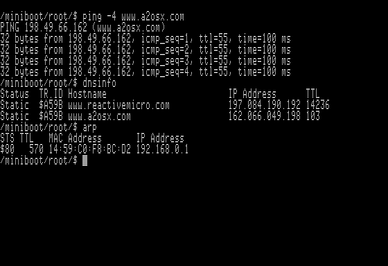
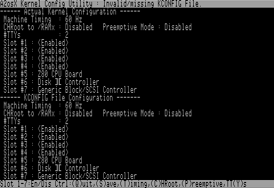

# A2osX (0.9.1) Multi-Tasking OS for Apple II  

...preemtive ? soon !

## Disk images :  

+ **A2OSX.BOOT.po**   :  **(0.9.1)**  140k BOOT disk image with all binaries  
+ **A2OSX.DEV.po**    :  **(0.9.1)**  140k disk image with ASM binaries, Debug Tools & INClude files  
+ **A2OSX.BUILD.po**  :  **(0.9.1)**  800k BOOT disk image with S-C MASM 2.0 and all binaries (BOOT+DEV)  
+ **A2OSX.SRC.po**    :  **(0.9.1)**  800k disk image with all sources  

## Latest News 2017-11-08

Kernel 0.9.1 stable enough to resume building.

 + KM.APPLETALK module not crashing anymore  
   (Undocummented AtInit function, had to go further in official ATINIT disassembly) 

 + Improved Command Line editing and history. 
   (SUPPR key is emulated with Ctrl-X using //e keyboard)

 + New DevMgr enumeration strategy, now including /RAM and other virtual Block Devices 
 
 + Math API (Hacked from APPLESOFT ROM ;-)

 + CSH Script engine in progress within Shell (In progress)
 
## Latest News 2017-09-22

(once Kernel 0.9.1 stable enough, BOOT & DEV will be updated) __(done!)__

**0.9 has been archived, next Kernel Version is 0.9.1**  
   
 + More Standard C API compliance __(done!)__
 + API Cleanup, many functions still use shared space __(done!)__
 + Per process Stack Segment __(done!)__
 + Larger S.PS structure __(done!)__
 + ...
 + to allow...Preemtive!

**"System Tick" sources for preemtive mode :**

| Hardware                 | Resolution | Status      | Comment |
| -------------------------| ---------- | ----------- | ------- |
| //c,//c+,IIgs Mouse port | 50/50 Hz   | Working     | Supported at Kernel level, no conflict with GUI's Mouse.DRV (not required to be loaded), requires setting "Machine Timing" properly in KConfig Utility |
| IIe Mouse Card           | 50/50 Hz   | Working     | (same as above) |
| ThunderClock Plus        | 64 Hz      | In Progress | ...Need to fix this faulty H/W first! |
| ... Any suggestion ?     |            |             |  |

## !!!HELP NEEDED!!!

Thanx a lot for all positive comments i read here and there, but i definitively need contributors & testers.

Anybody wants to join this project ?

If you're interested on contributing, please send a message with your skills and in which area you are interested to work on (Network, Kernel, device drivers for additional hardware support, GUI, graphical resourses, command line tools....)

This is some sort of "last hope call", some of you were right, this project is really huge!!! 
Anyway, i'm convinced that a small team of developers could reach "version 1.0" with GUI & network support in few months....i'm working on it for...4 years now, spending the most of my free time fixing hardware to test this code instead of...writing it! 

Well, let me know if you can bring "fresh blood" to this stuff... 

## Requires :
Enhanced IIe (65c02 cpu) with 128k, //c, IIgs

## Introduction...
A2osX is a cooperative, event-driven multitasking kernel (meaning it is applications that are responsible to give back control to kernel)
Its principal goal is to collect all "genius" 65c02 pieces of code ever written here and there, concentrated in the same environment.
(including IP Stack & HTTPD/TELNETD..., GUI & graphical tools...)
"Complete working place", no needing any more to reboot to switch between tons of diskettes!!!

A2osX is designed to work on any "stock" 128k Apple //e, with no additional hardware. As VBL signal is NOT available as an IRQ on //e (it is on //c & IIgs)
it makes preemptive multitasking impossible.

__A new attempt using Mouse card VBL IRQ is targeted in 0.9.1.__

Kernel, loading in Aux LC on top of ProDOS provide API inspired from Linux/Unix World to allow writing applications & command line tools on top of it.
This kernel provides an advanced "Memory Manager" able to relocate 65c02 code.
"Event Manager" makes TCPIP stack able to listen on several ports, manage ARP,DNS...cache expiration and any background processes.
"Task Manager" is responsible to "distribute" CPU time to several loaded processes.
"Device Manager" handles event collected from builtin devices as well as devices added by loadable drivers.

If you're 65c02 or Z80 code writer, how to contribute ?

Several subprojects are now indentified :

+ Hardware Support : adding drivers to support more & more hardware (RAM cards, storage....)
+ Z80 support : Kernel could pass control to any Z80 detected on the system.
+ TCP/IP stack
+ AppleTalk Support
+ GUI & Printing
+ Archive, Disk Image transfer tools (ADT client!)...
+ Question : Pascal or C Compiler? 
+ --> Answer : C compiler....Next version of Kernel API will be closer to STDLIBC, Genralize the use of C-Strings
+ ...sure there is some more!

## Screenshots

UNIX-Like Shell...

TCP/IP Stack...

Full screen editor ...

Kernel Configuration Utility...

Color ANSI/VT100 Support !!!

## General Information:

Kernel API is confined in Aux LC Bank 1 & 2 to leave enough room at $EOOO for Drivers.
Network drivers, Mouse, DHGR.DRV can load and fit in Aux LC.
Now it's time to make all external BINs use new API, then GUI development will resume.

OApple+1,OApple+2,OApple+3 to switch between screens : Kernel Log, text, DHGR.
(OApple+shift+1,OApple+shift+2,OApple+shift+3 on FR keyboard)

## SYS/KM* Supported Hardware At Kernel Level (ProDOS):

| KM.Name      | Status  | Comment |
| -------      | ------  | ------- |
| KM.NSC       | Working | No-Slot-Clock/DS1216E |
| KM.RAMWORKS  | Working | AE-Ramworks I,II,III  |
| KM.VSDRIVE   | Working | ADTPro Virtual Drive for SSC |
| KM.APPLETALK | Working | AppleTalk Support for ProDOS |

## SBIN,Daemons/Commands:

| Name    | Status      | Comment | K.Ver |
| ----    | ------      | ------- | ------|
| INSDRV  | Working     |         | 0.9.1 |
| GETTY   | Working     |         | 0.9.1 |
| LOGIN   | In Progress | no auth using /etc/passd yet | 0.9.1 |
| SHELL   | Working     | (See Internal Shell commands) | 0.9.1 |
| KCONFIG | Working     | Kernel Configuration Utility | 0.9.1 |
| ----    | ------      | ------- | ----- |
| TCPIPD  | Working     | Socket API.ARP,IP,ICMP,UDP & TCP ok | 0.9 |
| DHCPCLNT| Working     | rewritten to use new Socket API | 0.9 |
| TELNETD | In Progress |  | 0.9 |
| HTTPD   | In Progress |  | 0.9 |

## Internal Shell commands:

| Name      | Status  | Comment |
| ----      | ------  | ------- |
| CD        | Working | Improved syntax : now, 'CD ../BIN' works |
| PWD       | Working | |
| DATE      | Working | |
| ECHO      | Working | \b,\e,\f,\n,\\\ and \\% supported |
| EXIT      | Working | |
| PAUSE     | Working | |
| READ      | Working | -S : no echo (password) |
|           |         | -P : "prompt message"   |
| TIME      | Working | |
| SET       | Working | |
| SLEEP     | Working | |
| STARTPROC | Working | Used in A2osX.startup |

## Shell variables:

| Name  | Status  | Comment |
| ----  | ------  | ------- |
| $PWD  | Working | 'Working Directory' |
| $0    | Working | Command Full Path |
| $1-$9 | Working | Arg[n] |
| $*    | Working | All Args |
| $#    | Working | Arg Count |
| $?    | Working | Return Code |
| $@    | Working | Parent PID |
| $$    | Working | PID |
| $!    | Working | Child PID |

note : '$VAR' does NOT expand Variable

## DRV,Drivers:

| Name | Status | Comment | K.Ver |
| ---- | ------ | ------- | ----- |
| Console.DRV | Working | ANSI support in Progress. | 0.9.1 |
| SSC.DRV     | Working | Apple "Super Serial Card" Driver | 0.9.1 |
| SSC.I.DRV   | Working | Apple "Super Serial Card" Driver (IRQ enabled) | 0.9.1 |
| PIC.DRV | In Progress | Apple "Parallel Interface Card" Driver, renamed from PPIC.DRV | 0.9 |
| Mouse.DRV | Working | Apple Mouse Card,//c Mouse Port | 0.9 |
| DHGR.DRV | In Progress | except bitblt... | 0.9 |
| ---- | ------ | ------- | ----- |
| LanCeGS.DRV | Working | | 0.9 |
| Uthernet.DRV  | Working | | 0.9 |
| Uthernet2.DRV | Working | | 0.9 |
| Uther2.AI.DRV | In Progress | With ARP/IP Offloading | 0.9 |

## BIN,External Shell commands:
| Name | Status | Comment | K.Ver |
| ---- | ------ | ------- | ----- |
| MEM | Working | Old dump behavior is now MEMDUMP.  New MEM command displays MEMSTAT (Main, Aux & Kernel Memory) | 0.9.1 |
| LSDEV | Working | | 0.9.1 |
| PS | Working | | 0.9.1 |
| MD | Working | | 0.9.1 |
| LS | Working | -A : Do Not Print . & .. | 0.9.1 |
| | | -L : long listing with size/date... | |
| | | -R : Recurse subdirectories | |
| RM | Working | -C : Continue On Error | 0.9.1 |
| | | -Q : Quiet | |
| | | -R : Recurse subdirectories | |
| CP | Working | -C : Continue On Error | 0.9.1 |
| | | -Q : Quiet | |
| | | -R : Recurse subdirectories | |
| | | -Y : Dont't Prompt For Override | |
| MV | Working | -C : Continue On Error | 0.9.1 |
| | | -Q : Quiet | |
| | | -R : Recurse subdirectories | |
| | | -Y : Dont't Prompt For Override | |
| CAT | Working | -A : Show All non printable caracters | 0.9.1 |
| | | -N : Number all output lines | |
| | | -S : Suppress repeated empty output lines | |
| CHTYP | Working | -C : Continue On Error | 0.9.1 |
| | | -R : Recurse subdirectories | |
| CHMOD | In Progress | -C : Continue On Error | 0.9 |
| | | -R : Recurse subdirectories | |
| CHOWN | In Progress | -C : Continue On Error | 0.9 |
| | | -R : Recurse subdirectories | |
| CHGRP | In Progress | -C : Continue On Error | 0.9 |
| | | -R : Recurse subdirectories | |
| FORMAT | In Progress | -L : Low-Level Format | 0.9.1 |
| EDIT | Working | still missing : find/replace | 0.9 |
| NSCUTIL | Working | Tool for setting time in NSC/DL1216E | 0.9 |
| ---- | ------ | ------- | ----- |
| ARP | Working | dump ARP cache, setup a static ARP entry | 0.9 |
| PING | Working | | 0.9 |
| DNSINFO | Working | dump DNS cache, setup a static DNS entry | 0.9 |
| IPCONFIG | Working | renamed from NETINFO | 0.9 |
| NETSTAT | Working | | 0.9 |

## BIN,External DEV Shell commands:
| Name | Status | Comment | K.Ver |
| ---- | ------ | ------- | ----- |
| ASM | In Progress | S-C MASM based multi CPU assembler | 0.9 |
| MEMDUMP | Working | | 0.9.1 |
| ---- | ------ | ------- | ----- |
| RPCDUMP | Working | tool based on UDP socket API, renamed from RPCINFO | 0.9 |

## Misc

### S-C MASM color scheme for Notepad++
...drop _Tools/userDefineLang.xml in %APPDATA%\Notepad++
;-)

