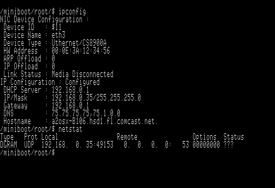

# A2osX (0.92) Multi-Tasking OS for Apple II  

## Disk images :  

+ **A2OSX.BOOT.po**   :  **(0.92)**  140k BOOT disk image with all binaries  
+ **A2OSX.DEV.po**    :  **(0.92)**  140k disk image with ASM binaries, Debug Tools & INClude files  
+ **A2OSX.BUILD.po**  :  **(0.92)**  800k BOOT disk image with S-C MASM 3.0 and all binaries (BOOT+DEV)  
+ **A2OSX.SRC.po**    :  **(0.92)**  800k disk image with all sources  

## Latest News 2019-02-19

Major updates have occured to the kernel and many of the APIs to support an enhanced shell with support of many new scripting capabilities, the ability to redirect and eventually piping output.  Current kernel also supports multiple virtual terminals as well as TCP (via TELNETD) and serial (SSC driver) terminals.

## Latest News 2018-11-10

My loneliness has been cured, new resources have signed onto the project.  I welcome Patrick Kloepfer
who is helping with product management, recruitment, testing and feedback. 

## News 2018-09-06

0.92 stable enough to resume playing with.
Many 0.9.1 bugs already corrected in this version, please check & close opened issues.

## News 2018-07-20

Kernel & some BINs/SBINs migrated to 0.92.

## News 2018-06-17

Ok, as i'm still the lone developer here, i decided to break the kernel, HAHAHAHAHAHA!!!!
I updated the Calling Convention (see projects), i now setup the header in each KERNEL.S.* file accordingly to generate doc, then i change the code...

So ....nothing works anymore on the A2OSX.BUILD media...

## News 2018-06-13

Previous (relatively!) stable version 0.9.1 has been archived, see link above.  

Roadmap for 0.9.2:
 + Organize this roadmap in projects (anybody interested in a PM job ?)
 + Organize Testing (Testers wellcome)
 + NET : TCPIP Network services, AppleTalk (Coders wellcome)
 + GUI : Window Manager (Coders wellcome)
 + DEV : ASM, CSH, C compiler, someone suggested PLASMA (Coders wellcome)
 + release Version 1.0.0
 
Sub projects:
 + Finalize enhanced STDIO (Buffered IO)
 + Link UDP/TCP sockets to new STDIO
 + Rewrite Driver interface (SmartPort Protocol) and link to STDIO
 + establish parameter passing convention (C-like Stack frame)
 + Move all LIBs to this new convention to allow preemtive mode for LIBs
 + AT commands (Appletalk)
 + TELNETD/HTTPD/NFSD (STDIO)
 + GUI : Window Manager, Controls...
 + Assembler (AUX mem manager) will allow A2osX to build entirely itself every night!
 + Shell CSH (MATH API, AUX mem manager)
 + C compiler (Stack Frame, MATH API, AUX mem manager)
 + Disk II format (LIBBLKDEV)
 + Simple compression API (LIBPAK)
 + CSH+LIBPACK -> A2osX Installer
 + TCPIP+SSC DRV+LIBBLKDEV -> ADT Client
 + /etc/passwd (LIBCRYPT)

I need :
 + someone able to handle project management so i can focus on code writing
 + developers interested in one of these subjects above
 + someone able to build a test plan
 + ....ideas...help....support....beer, or something stronger! 

## News 2018-05-29

Time to work on STDIO : 

 + Buffered IO to link TCP/IP stream sockets properly to STDIN,STDOUT,STDERR (TELNETD)
 + Implement missing STDIO functions (Puts, FPuts...)
 + Faster Console output
 + Better 'C-Like' API

Scope : KERNEL.STDIO, All drivers, CDEV, FIFO,...

Goal : TELNETD & HTTPD working.

Wanna play ? 

## News 2018-04-29

Kernel 0.9.1 is now preemptive. 

It defaults to cooperative mode ('P'olling mode). For this, no particular hardware needed (except 65c02 and 128k, of course!)

If you want to enable preemptive mode, all you need is a "tick" source to get 'V'BL or 'C'lock Mode.
(see below for supported hardware)

Then you must explicitly ENABLE it using KCONFIG utility. (see screenshot below)

You can monitor the kernel state on the 'SYS' screen (OA-1, or SHIFT-OA-1 on french keyboards) and look at the upper right corner, you should see a blincking 'P', 'V' or 'C', showing you the current kernel state..

If you enabled preemptive mode, you should see an additional blinking 'S', each time the kernel switch from one PS to another.

Reminder : 
 + (SHIFT)-OA-1 : Kernel SYS Screen
 + (SHIFT)-OA-2 : Console Screen (Shell...)
 + (SHIFT)-OA-3 : DHGR Screen (if loaded)

For now, only SBIN/BIN executables are "switcheable". 

Roadmap is as follow: 

 + Check all BIN/SBIN sources to make them preemptive compliant, most of them are NOT. 
 + Add a way to make LIB also interruptible and reentrant.
 + Add more supported hardware for system clock.
 + ...and  still hoping finding few contributors.... :-(

## News 2017-11-08

Kernel 0.9.1 stable enough to resume building.

 + KM.APPLETALK module not crashing anymore  
   (Undocummented AtInit function, had to go further in official ATINIT disassembly) 

 + Improved Command Line editing and history. 
   (SUPPR key is emulated with Ctrl-X using //e keyboard)

 + New DevMgr enumeration strategy, now including /RAM and other virtual Block Devices 
 
 + Math API (Hacked from APPLESOFT ROM ;-)

 + CSH Script engine within Shell (In progress)
 
## News 2017-09-22

(once Kernel 0.9.1 stable enough, BOOT & DEV will be updated) __(done!)__

**0.9 has been archived, next Kernel Version is 0.9.1**  
   
 + More Standard C API compliance __(done!)__
 + API Cleanup, many functions still use shared space __(done!)__
 + Per process Stack Segment __(done!)__
 + Larger S.PS structure __(done!)__
 + ...
 + to allow...Preemptive!

**"System Tick" sources for preemptive mode :**

| Hardware                 | Resolution | Status      | Comment |
| -------------------------| ---------- | ----------- | ------- |
| //c,//c+,IIgs Mouse port | 50/60 Hz   | Working     | Supported at Kernel level, no conflict with GUI's Mouse.DRV (not required to be loaded), requires setting "Machine Timing" properly in KConfig Utility |
| IIe Mouse Card           | 50/60 Hz   | Working     | (same as above) |
| ThunderClock Plus        | 64 Hz      | Working     | gave up fixing this faulty H/W, thanx to JACE emulator! |
| Super Serial Card |      ?      | Idea, from EtchedPixels | #31 |
| MockingBoard     |      ?      | Idea, from Michael |  |
| GOES Irq Card  |      ?      | Idea, from Oliver | #34 |
| ... Any Other suggestion ?     |            |             |  |

## !!!HELP NEEDED!!!

Thanx a lot for all positive comments i read here and there, but i definitively need contributors & testers.

Anybody wants to join this project ?

If you're interested on contributing, please send a message with your skills and in which area you are interested to work on (Network, Kernel, device drivers for additional hardware support, GUI, graphical resourses, command line tools....)

This is some sort of "last hope call", some of you were right, this project is really huge!!! 
Anyway, i'm convinced that a small team of developers could reach "version 1.0" with GUI & network support in few months....i'm working on it for...4 years now, spending the most of my free time fixing hardware to test this code instead of...writing it! 

Well, let me know if you can bring "fresh blood" to this stuff... 

## Requires :
Enhanced IIe (65c02 cpu) with 128k, //c, IIgs

## Introduction...
A2osX is a cooperative, event-driven multitasking kernel (meaning it is applications that are responsible to give back control to kernel)
Its principal goal is to collect all "genius" 65c02 pieces of code ever written here and there, concentrated in the same environment.
(including IP Stack & HTTPD/TELNETD..., GUI & graphical tools...)
"Complete working place", no needing any more to reboot to switch between tons of diskettes!!!

A2osX is designed to work on any "stock" 128k Apple //e, with no additional hardware. As VBL signal is NOT available as an IRQ on //e (it is on //c & IIgs)
it makes preemptive multitasking impossible.

__A new attempt using Mouse card VBL IRQ is targeted in 0.9.1.__

Kernel, loading in Aux LC on top of ProDOS provide API inspired from Linux/Unix World to allow writing applications & command line tools on top of it.
This kernel provides an advanced "Memory Manager" able to relocate 65c02 code.
"Event Manager" makes TCPIP stack able to listen on several ports, manage ARP,DNS...cache expiration and any background processes.
"Task Manager" is responsible to "distribute" CPU time to several loaded processes.
"Device Manager" handles event collected from builtin devices as well as devices added by loadable drivers.

If you're 65c02 or Z80 code writer, how to contribute ?

Several subprojects are now indentified :

+ Hardware Support : adding drivers to support more & more hardware (RAM cards, storage....)
+ Z80 support : Kernel could pass control to any Z80 detected on the system.
+ TCP/IP stack
+ AppleTalk Support
+ GUI & Printing
+ Archive, Disk Image transfer tools (ADT client!)...
+ Question : Pascal or C Compiler? 
+ --> Answer : C compiler....Next version of Kernel API will be closer to STDLIBC, Genralize the use of C-Strings
+ ...sure there is some more!

## Screenshots

UNIX-Like Shell...

TCP/IP Stack...

Full screen editor ...

Kernel Configuration Utility...

Color ANSI/VT100 Support...

DHGR Mixed-Mode Graphic primitives....

## General Information:

Kernel API is confined in Aux LC Bank 1 & 2 to leave enough room at $EOOO for Drivers.
Network drivers, Mouse, DHGR.DRV can load and fit in Aux LC.
Now it's time to make all external BINs use new API, then GUI development will resume.

OApple+1,OApple+2,OApple+3 to switch between screens : Kernel Log, text, DHGR.
(OApple+shift+1,OApple+shift+2,OApple+shift+3 on FR keyboard)

## SYS/KM* Supported Hardware At Kernel Level (ProDOS):

| KM.Name      | Status  | Comment |
| -------      | ------  | ------- |
| KM.APPLETALK | Working | AppleTalk Support for ProDOS |
| KM.NSC       | Working | No-Slot-Clock/DS1216E |
| KM.RAMWORKS  | Working | AE-Ramworks I,II,III  |
| KM.VSDRIVE   | Working | ADTPro Virtual Drive for SSC |

## SBIN,Daemons/Commands:

| Name    | Status      | Comment | K.Ver |
| ----    | ------      | ------- | ------|
| DHCPCLNT| Working     | rewritten to use new Socket API | 0.92 |
| GETTY   | Working     | -E : Exit on remote close | 0.92 |
| HTTPD   | In Progress |  | 0.9 |
| INSDRV  | Working     |         | 0.92 |
| KCONFIG | Working     | Kernel Configuration Utility | 0.92 |
| LOGIN   | In Progress | no auth using /etc/passwd yet | 0.92 |
| SHELL   | Working     | (See Internal Shell commands) | 0.92 |
| TCPIPD  | Working     | ARP,IP,ICMP,UDP & TCP ok | 0.92 |
| TELNETD | Working  |  | 0.92 |

## Internal Shell commands:

| Name      | Status  | Comment |
| ----      | ------  | ------- |
| BREAK      |  | |
| CD        | Working | Improved syntax : now, 'CD ../BIN' works |
| conditions | Working |[ -d direxists ] |
|           |         | [ -e fileordirexists ] |
|           |         | [ -f fileexists ] |
|           |         | [ -n $VAR variable is not empty ] |
|           |         | [ -z $VAR variable is empty ] |
|           |         | [ string1 = string2 ] |
|           |         | [ string1 != string2 ] |
|           |         | [ string1 .< string2 ] |
|           |         | [ string1 <= string2 ] |
|           |         | [ string1 .> string2 ] |
|           |         | [ string1 >= string2 ] |
|           |         | [ int32 -eq int32 ] |
|           |         | [ int32 -ne int32 ] |
|           |         | [ int32 -lt int32 ] |
|           |         | [ int32 -le int32 ] |
|           |         | [ int32 -gt int32 ] |
|           |         | [ int32 -ge int32 ] |
| CONTINUE   |  | |
| DATE      | Working | |
| ECHO      | Working | \b,\e,\f,\n,\\\ and \\% supported |
|           |         | -N : Suppress \r\n |
| ELSE      | Working | Optional branch for IF block |
| EXIT      | Working | exit shell |
| FI        | Working | Terminator for IF block |
| IF        | Working | [ (condition) ] |
| LOOP      | Working | Terminator for WHILE block |
| MD        | Working | Create a directory |
| NOHUP     | Working | Start a process with PPID=PS0 (Daemon) |
| PAUSE     | Working | Wait until CR |
| POPD      | Working | Restore previously saved working directory |
| PUSHD     | Working | Save actual working directory |
|           |         | PUSHD <dir> do aslo a CD to <dir> |
| PWD       | Working | Print Working Directory |
| RD        | Working | Delete an empty directory |
| READ      | Working | -S : no echo (password) |
|           |         | -P : "prompt message"   |
| REN       | Working | Rename a file, directory or volume |
| SET       | Working | -X toggle debug mode |
|           |         | -C toggle Control-C break mode |
| SHIFT     | Working | Remove $1 from cmd line |
| SLEEP     | Working | Wait <count> 10th sec |
| TIME      | Working | |
| WHILE     | Working | [ (condition) ] |

## Shell variables:

| Name  | Status  | Comment |
| ----  | ------  | ------- |
| $0    | Working | Command Full Path |
| $1-$9 | Working | Arg[n] |
| $*    | Working | All Args |
| $#    | Working | Arg Count |
| $?    | Working | Return Code |
| $@    | Working | Parent PID |
| $$    | Working | PID |
| $!    | Working | Child PID |
| $UID  | Working | PS Owner UID |
| $PWD  | Working | Working Directory |

note : '$VAR' does NOT expand Variable

## Shell I/O control/redirection:

| Token  | Status  | Comment |
| ----  | ------  | ------- |
| . | Working | use same env |
| & | Working | start proc |
| \| | Working | pipe |
| <    | Working | StdIn redirection |
| >    | Working | StdOut redirection |
| >>    | Working | Append StdOut  |
| 1>>    | Working |  |
| 1>   | Working |  |
| 2>>    | Working | StdErr redirection |
| 2>     | Working |  |

## DRV,Drivers:

| Name | Status | Comment | K.Ver |
| ---- | ------ | ------- | ----- |
| Console.DRV | Working | ANSI support in Progress. | 0.92 |
| DHGR.DRV | Working | 560x192 Mono/16 colors Mixed-Mode support | 0.9.1 |
| LanCeGS.DRV | Working | | 0.92 |
| Mouse.DRV | Working | Apple Mouse Card,//c Mouse Port | 0.9.1 |
| PIC.DRV | In Progress | Apple "Parallel Interface Card" Driver, renamed from PPIC.DRV | 0.9 |
| SSC.DRV     | Working | Apple "Super Serial Card" Driver | 0.92 |
| SSC.I.DRV   | Working | Apple "Super Serial Card" Driver (IRQ enabled) | 0.92 |
| Uthernet.DRV  | Working | | 0.92 |
| Uthernet2.DRV | Working | | 0.92 |
| Uther2.AI.DRV | In Progress | With ARP/IP Offloading | 0.92 |

## BIN,External Shell commands:
| Name | Status | Comment | K.Ver |
| ---- | ------ | ------- | ----- |
| CAT | Working | -A : Show All non printable caracters | 0.92 |
| | | -N : Number all output lines | |
| | | -S : Suppress repeated empty output lines | |
| CHGRP | In Progress | -C : Continue On Error | 0.9 |
| | | -R : Recurse subdirectories | |
| CHMOD | In Progress | -C : Continue On Error | 0.9 |
| | | -R : Recurse subdirectories | |
| CHOWN | In Progress | -C : Continue On Error | 0.9 |
| | | -R : Recurse subdirectories | |
| CHTYP | Working | -C : Continue On Error | 0.92 |
| | | -R : Recurse subdirectories | |
| CP | Working | -C : Continue On Error | 0.92 |
| | | -Q : Quiet | |
| | | -R : Recurse subdirectories | |
| | | -Y : Dont't Prompt For Override | |
| EDIT | Working | still missing : find/replace | 0.92 |
| FORMAT | In Progress | FORMAT \<BLOCKDEV\> [VOLUME.NAME] | 0.92 |
| | | -L : Low-Level Format *not currently supported | |
| | | -1..9 : Catalog Size (block count) | |
| KILL | Working | KILL \<signal\> PID | 0.92 |
| | | -0 : No Signal | |
| | | -1 : SIGQUIT | |
| LS | Working | -A : Print . & .. | 0.92 |
| | | -C : Single column listing | |
| | | -L : long listing with size/date... | |
| | | -R : Recurse subdirectories | |
| LSDEV | Working | Dump device Drivers | 0.92 |
| LSOF | Working | List Open Files | 0.92 |
| MD5 | Working | MD5 \[ -D : String \| file \] | 0.92 |
| MEM | Working | Old dump behavior is now MEMDUMP.  New MEM command displays MEMSTAT (Main, Aux & Kernel Memory) | 0.92 |
| MKDIR | Working | Make Directory| 0.92 |
| MORE | Working | MORE \<File\> | 0.92 |
| | | -H : This help screen | |
| | | -N : Number all output lines | |
| | | -P : Page mode, no scroll | |
| | | -S : Process ESC codes | |
| NSCUTIL | Working | NSCUTIL DD/MM/YY,hh:mm:ss | 0.92 |
| | | Tool for setting time in NSC/DL1216E | |
| MV | Working | -C : Continue On Error | 0.92 |
| | | -Q : Quiet | |
| | | -R : Recurse subdirectories | |
| | | -Y : Dont't Prompt For Override | |
| PS | Working | List Processes| 0.92 |
| RM | Working | RM \[File/Dir, *,? wildcards allowed\] | 0.92 |
| | | -C : Continue On Error | |
| | | -Q : Quiet | |
| | | -R : Recurse subdirectories | |

## Network (TCPIP) tools:
| Name | Status | Comment | K.Ver |
| ---- | ------ | ------- | ----- |
| ARP | Working | dump ARP cache, setup a static ARP entry | 0.92 |
| DNSINFO | Working | dump DNS cache, setup a static DNS entry | 0.92 |
| HTTPGET | In Progress | HTTPGET <ip\|host> [port] | 0.93 |
| | | -U Url | |
| | | -F UrlFile | |
| IPCONFIG | Working | -D : Try to get IP address from DHCP | 0.92 |
|  |  | -E : Read ETC files |  |
|  |  | -S : Set/Reset TCPIP configuration (-E, then -D if required) |  |
| NETSTAT | Working | | 0.92 |
| PING | Working | PING <ip\|host> | 0.92 |
| | | -1..9 : Ping Count | |
| TELNET | Working | TELNET <ip\|host> [port] | 0.92 |

## DEV tools:
| Name | Status | Comment | K.Ver |
| ---- | ------ | ------- | ----- |
| ASM | In Progress | S-C MASM based multi CPU assembler | 0.9.1 |
| MEMDUMP | Working | Tool to track memory leak| 0.92 |
| ---- | ------ | ------- | ----- |
| RPCDUMP | In Progress | tool based on UDP socket API, renamed from RPCINFO | 0.92 |
| | | RPCDUMP <ip\|host> | |

## Misc

### S-C MASM color scheme for Notepad++
...drop _Tools/userDefineLang.xml in %APPDATA%\Notepad++
;-)

