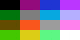

# A2osX Color Guide

### Updated December 17, 2019

This Guide provides information on the colors used for the logos supplied with A2osX.  This Guide is an internatl document to capture the RGB values of used in all the logos.

## Color Palette

| Color        | Red | Green | Blue |    Web   |
|--------------|-----|-------|------|----------|
| Black        |   0 |    0  |    0 | 00000000 |
| Red          | 147 |   11  |  124 | 930b7c00 |
| Dark Blue    |  31 |   53  |  211 | 1f35d300 |
| Purple       | 187 |   54  |  255 | bb36ff00 |
| Dark Green   |   0 |  118  |   12 | 00760c00 |
| Dark Gray    | 126 |  126  |  126 | 7e7e7e00 |
| Blue         |   7 |  168  |  224 | 07a8e000 |
| Light Blue   | 157 |  172  |  255 | b5afff00 |
| Brown        |  98 |   76  |    0 | 624c0000 |
| Orange       | 249 |   86  |   29 | f9561d00 |
| Light Grey   | 156 |  156  |  156 | 9c9c9c00 |
| Pink         | 255 |  129  |  236 | ff81ec00 |
| Light Green  |  67 |  200  |    0 | 43c80000 |
| Yellow       | 220 |  205  |   22 | dccd1600 |
| Aqua         |  93 |  247  |  132 | 5df78400 |
| White        | 255 |  255  |  255 | ffffff00 |

## License
A2osX is licensed under the GNU General Public License.

    This program is free software; you can redistribute it and/or modify
    it under the terms of the GNU General Public License as published by
    the Free Software Foundation; either version 2 of the License, or
    (at your option) any later version.

    This program is distributed in the hope that it will be useful,
    but WITHOUT ANY WARRANTY; without even the implied warranty of
    MERCHANTABILITY or FITNESS FOR A PARTICULAR PURPOSE.  See the
    GNU General Public License for more details.

The full A2osX license can be found **[Here](../LICENSE)**.

## Copyright

Copyright 2015 - 2019, Remy Gibert and the A2osX contributors.
